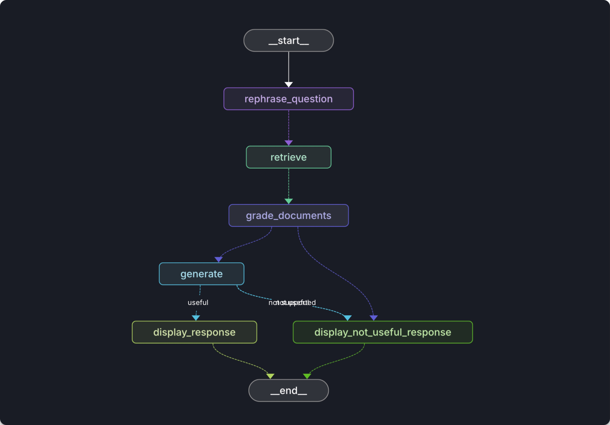

# oberlin-consulting-club

## Environment Variables

Copy the `.env.example` to create a new file `.env`

```txt
PINECONE_API_KEY=
OPENAI_API_KEY=
# OPTIONAL TRACING
LANGSMITH_PROJECT=
LANGSMITH_TRACING=true
LANGSMITH_ENDPOINT=https://api.smith.langchain.com/
LANGSMITH_API_KEY=
```

## Installation guide (uv)

```shell
curl -LsSf https://astral.sh/uv/install.sh | sh
```

After uv is installed, install project dependencies with

```shell
uv sync
```

Run the program

```shell
uv run --env-file=.env streamlit run app.py
```

## Development

Install langgraph cli

```shell
uv tool install langgraph-cli[inmem]
```

Run langgraph development server

```shell
uvx langgraph dev
```

## Graph Diagram


